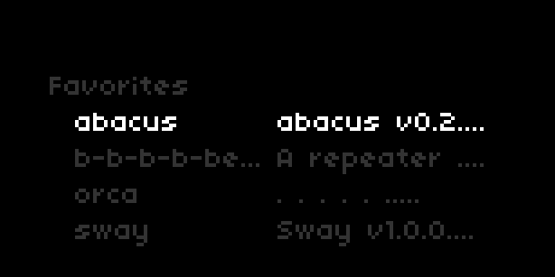
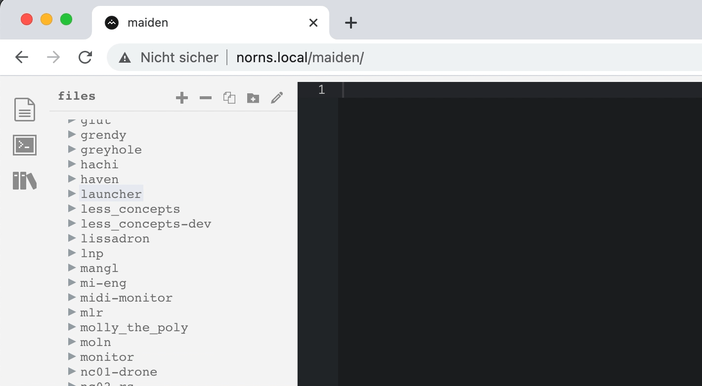

Launcher
--

### A launcher (kludge) for scripts with descriptions.

Scripts that have been [favorited](https://monome.org/docs/norns/play/#favorites) will automatically be added to the top to the list with a description<sup>1</sup>.



| Controller                    | Description                               |
| ----------------------------- | ----------------------------------------- |
| E1                            | Scroll list                               |
| K2                            | Launch selected script                    |


## Install

```
;install https://github.com/frederickk/launcher
```

In order, to have `Launcher` appear at the top of all available scripts, after install simply rename the containing folder to `AA_`




## Customize

The included `data.json` file should be edited to suit your needs and taste. The schema is quite simple.

```json
{
  "<category>": [
    ["<script_name>", "<description>"]
  ],
  ...
}
```

---

<sup>1</sup> The automatically added "metadata" is simply a scrape of the first 2 lines of the script. It's certainly not perfect, but it's a start :)